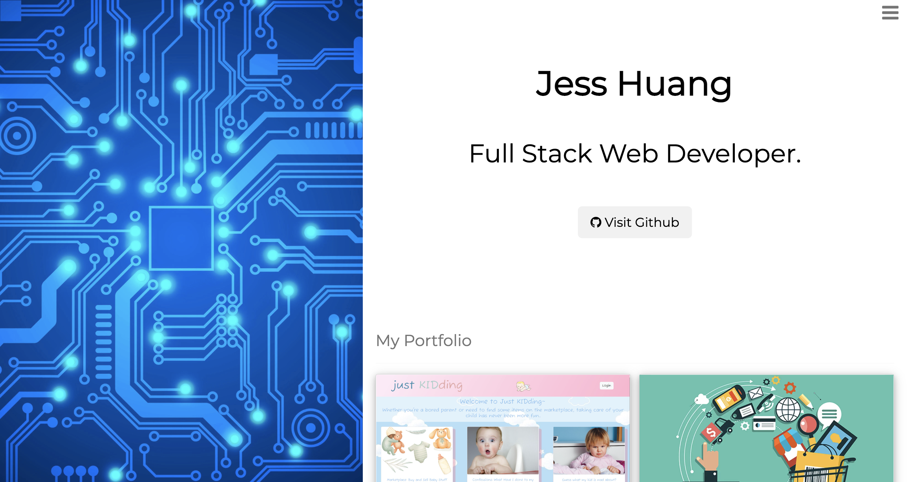
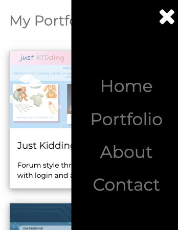

# Portfolio v3

## Description

Updating Key16's portfolio using the w3 schools CSS library as a new library.

The page is available live [here](https://key16.github.io/Portfolio-v3/)

## Table of Contents

- [Usage](#usage)
- [Licenses](#licenses)
- [Contributing](#contributing)
- [Questions](#questions)

## Usage

How to use this code

View live code [here](https://key16.github.io/Portfolio-v3/)

## Licenses

This project is under the MIT License.

## Contributing

Contributions are what make the open source community such an amazing place to learn, inspire, and create.

Please let me know if there are any new recommendations

## Questions

If you have any questions regarding this repository, you can contact me directly at jh.yield@gmail.com or find more of my work at [Key15](https://github.com/Key15)
